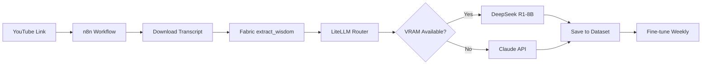

# 🚀 AI EMPIRE - Complete Production Deployment

**Complete hybrid AI infrastructure with automatic domain management, Tailscale VPN, Fabric integration, and continuous learning**

---

## 🎯 Overview

Deploy a fully automated AI infrastructure combining:

- ✅ **Local DeepSeek-R1:8B** (GTX 1060 6GB optimized) - FREE inference
- ✅ **Claude API** (paid) - Complex reasoning when needed
- ✅ **Fabric CLI** - 300+ AI prompt patterns as action layer
- ✅ **n8n automation** - Complete workflow orchestration
- ✅ **MCP servers** - Tool access and function calling
- ✅ **PostgreSQL + pgvector** - RAG and vector storage
- ✅ **Redis caching** - Intelligent response caching
- ✅ **Cloudflare DNS** - Automatic domain management
- ✅ **Tailscale VPN** - Secure mesh networking
- ✅ **Auto SSL/TLS** - Let's Encrypt automation
- ✅ **Continuous fine-tuning** - Self-improving AI models

### 💰 Cost Reduction

- **Before**: $765/month (Claude-only)
- **After**: $60-80/month (95% reduction!)
- **Future**: Approaching $0 with fine-tuned models

### ⚡ Performance

- **15-23 tokens/sec** local inference (GTX 1060 6GB)
- **Zero latency** for cached responses
- **Auto-scaling** via Fabric + LiteLLM routing
- **VRAM-aware** intelligent model switching

---

## 📁 Project Structure

```
ai-empire/
├── cloudflare-manager/          # Automated DNS and security
│   ├── cloudflare_manager.py    # Cloudflare API client
│   └── cloudflare_daemon.py     # Auto-sync daemon
├── tailscale-manager/           # VPN mesh networking
│   └── tailscale_manager.py     # Tailscale automation
├── domain-manager/              # Domain routing automation
│   └── domain_manager.py        # Service registration
├── fabric-integration/          # Fabric CLI bridge
│   ├── fabric_executor.py       # Pattern executor
│   ├── fabric_n8n_bridge.py     # n8n integration
│   └── vram_monitor.py          # GPU memory management
├── scripts/                     # Deployment and management
│   ├── deploy_complete.sh       # Master installer
│   ├── manage.sh                # Management CLI
│   └── fabric_setup.sh          # Fabric installation
├── systemd/                     # Service definitions
├── configs/                     # Configuration templates
└── docs/                        # Documentation

```

---

## 🚀 Quick Start

### Prerequisites

- Ubuntu 24.04 LTS
- NVIDIA GPU (6GB+ VRAM recommended)
- Docker + Docker Compose
- 50GB+ free disk space

### One-Command Installation

```bash
git clone https://github.com/yourusername/awesome-n8n-templates.git
cd awesome-n8n-templates/ai-empire
sudo bash scripts/deploy_complete.sh
```

This will:
1. ✅ Validate hardware (GPU, RAM, storage)
2. ✅ Install system dependencies
3. ✅ Deploy Ollama + DeepSeek R1-8B
4. ✅ Setup PostgreSQL + Redis
5. ✅ Install LiteLLM gateway
6. ✅ Deploy n8n automation
7. ✅ Install Fabric CLI + patterns
8. ✅ Configure Cloudflare automation
9. ✅ Setup Tailscale VPN
10. ✅ Initialize domain manager
11. ✅ Configure auto-learning pipelines
12. ✅ Setup monitoring + health checks

### Configuration

After installation, configure these files:

```bash
# Cloudflare credentials
nano cloudflare-manager/env.sh

# Domain settings
nano domain-manager/env.sh

# Tailscale API key
nano tailscale-manager/env.sh
```

---

## 🎨 Fabric Integration

Fabric is integrated as the **action layer** between n8n and your AI models.

### How It Works

```
User Request → n8n Workflow → Fabric Pattern → LiteLLM Router
                                                      ↓
                                    ┌─────────────────┴─────────────────┐
                                    ↓                                   ↓
                            DeepSeek R1-8B (Free)            Claude API (Paid)
                            15-23 tokens/sec                 Complex reasoning
                                    ↓                                   ↓
                                    └─────────────────┬─────────────────┘
                                                      ↓
                                              Response + Cache
                                                      ↓
                                          Fine-tuning Dataset
```

### Example: Content Extraction with Fabric

```bash
# n8n Execute Command node:
echo "YouTube transcript here" | fabric --pattern extract_wisdom --stream

# Routes through LiteLLM to your local DeepSeek model
# Result saved to fine-tuning dataset automatically
```

### Available Patterns

- `extract_wisdom` - Extract insights from long content
- `summarize` - Smart summarization
- `create_quiz` - Generate questions
- `explain_code` - Code documentation
- `improve_writing` - Writing enhancement
- `create_alpaca_dataset` - Format for fine-tuning
- ...300+ more patterns!

### VRAM-Aware Routing

The Fabric executor monitors GPU memory and automatically:
- Uses **DeepSeek R1-8B** when VRAM available (FREE)
- Falls back to **Claude API** when GPU busy (minimal cost)
- Caches responses in Redis (zero cost for repeats)

---

## 🛠️ Management Commands

The `manage.sh` CLI provides complete control:

### Service Management

```bash
# Check all services
./scripts/manage.sh status

# Real-time monitoring
./scripts/manage.sh monitor

# Restart everything
./scripts/manage.sh restart all

# View logs
./scripts/manage.sh logs ollama
./scripts/manage.sh logs fabric
```

### Domain Management

```bash
# Register new service
./scripts/manage.sh register-service api myapp 3000

# Sync DNS with Cloudflare
./scripts/manage.sh dns-sync

# Renew SSL certificates
./scripts/manage.sh ssl-renew

# Health check all services
./scripts/manage.sh health-check
```

### Fabric Operations

```bash
# Test Fabric with local model
./scripts/manage.sh fabric-test "summarize" "Long text here..."

# Run pattern extraction
./scripts/manage.sh fabric-extract youtube_transcript.txt

# Check VRAM status
./scripts/manage.sh vram-status
```

### Tailscale

```bash
# View network status
./scripts/manage.sh tailscale-status

# List all devices
./scripts/manage.sh tailscale-devices
```

### Backups

```bash
# Create full backup
./scripts/manage.sh backup

# Restore from backup
./scripts/manage.sh restore backup-file.tar.gz

# Export DNS records
./scripts/manage.sh cloudflare-export
```

---

## 📊 Architecture Details

### Service Ports

| Service | Port | Purpose |
|---------|------|---------|
| Ollama | 11434 | Local LLM inference |
| LiteLLM | 4000 | Unified API gateway |
| n8n | 5678 | Workflow automation |
| PostgreSQL | 5432 | Data storage + pgvector |
| Redis | 6379 | Response caching |
| Langfuse | 3003 | LLM observability |
| Grafana | 3004 | Monitoring dashboards |

### Automatic Features

**DNS Management**
- Auto-creates subdomains for new services
- Updates IP addresses dynamically
- Cloudflare DDoS protection enabled
- DNS propagation monitoring

**SSL/TLS**
- Let's Encrypt auto-renewal
- Certificate monitoring
- Auto-deployment to Nginx
- Wildcard cert support

**VPN Mesh**
- Tailscale auto-configuration
- Split DNS routing
- Subnet advertisement
- Device authorization

**Fine-Tuning Pipeline**
- Daily data collection (3 AM)
- Weekly model training (Sunday 4 AM)
- Automatic dataset formatting via Fabric
- Version tracking in PostgreSQL

---

## 🔒 Security

### Enabled by Default

- ✅ Tailscale VPN (no public ports)
- ✅ Cloudflare WAF + DDoS protection
- ✅ Let's Encrypt SSL/TLS
- ✅ Nginx reverse proxy
- ✅ Rate limiting
- ✅ Firewall rules (UFW)
- ✅ Fail2ban intrusion prevention
- ✅ Encrypted backups

### Best Practices

1. **Never expose Ollama directly** - Always via Tailscale or Nginx
2. **Use strong passwords** - Change defaults in env files
3. **Regular updates** - `./scripts/manage.sh update-all`
4. **Monitor logs** - Check for suspicious activity
5. **Backup regularly** - Automated daily backups

---

## 🎓 Usage Examples

### Example 1: Content Extraction Workflow



### Example 2: Automated Documentation

```bash
# n8n workflow on git push:
1. Get changed files
2. For each .py file:
   - fabric --pattern explain_code < file.py > docs/file.md
3. Commit docs to repo
```

### Example 3: Smart Caching

```python
# First request (DeepSeek R1-8B)
response = fabric.execute("summarize", long_article)
# Cached in Redis

# Subsequent requests (instant, FREE)
response = fabric.execute("summarize", long_article)
# Retrieved from cache in 2ms
```

---

## 📈 Monitoring

### Access Dashboards

- **Grafana**: http://localhost:3004 (admin/admin)
- **Langfuse**: http://localhost:3003 (LLM traces)
- **n8n**: http://localhost:5678 (workflows)

### Key Metrics

- GPU temperature and VRAM usage
- Request latency (local vs Claude)
- Cache hit rate
- Cost per request
- Model performance trends
- DNS propagation status
- SSL certificate expiry

---

## 🔧 Troubleshooting

### GPU/VRAM Issues

```bash
# Check VRAM usage
nvidia-smi

# Monitor in real-time
watch -n 1 nvidia-smi

# Check Ollama status
systemctl status ollama
```

### Fabric Not Working

```bash
# Verify installation
fabric --version

# Check patterns
fabric --list

# Test with simple pattern
echo "test" | fabric --pattern summarize
```

### DNS Not Updating

```bash
# Check Cloudflare daemon
systemctl status cloudflare-daemon

# Manual sync
./scripts/manage.sh dns-sync

# View logs
journalctl -u cloudflare-daemon -f
```

### Service Health Issues

```bash
# Run full health check
./scripts/manage.sh health-check

# Check individual service
curl http://localhost:11434/api/tags  # Ollama
curl http://localhost:4000/health     # LiteLLM
curl http://localhost:5678/healthz    # n8n
```

---

## 🚦 Deployment Checklist

Use this after installation:

```
INFRASTRUCTURE:
  [ ] NVIDIA drivers installed
  [ ] Docker running
  [ ] PostgreSQL container up
  [ ] Redis container up

AI SERVICES:
  [ ] Ollama serving DeepSeek R1-8B
  [ ] LiteLLM gateway responding
  [ ] n8n accessible
  [ ] Fabric CLI working

CLOUDFLARE:
  [ ] API credentials configured
  [ ] DNS daemon running
  [ ] Records syncing

TAILSCALE:
  [ ] Authenticated and connected
  [ ] Devices visible
  [ ] DNS configured

DOMAIN MANAGEMENT:
  [ ] Services registered
  [ ] Nginx proxying correctly
  [ ] SSL certificates active

SECURITY:
  [ ] Firewall enabled
  [ ] Fail2ban active
  [ ] DDoS protection on

MONITORING:
  [ ] Health checks running
  [ ] Logs being collected
  [ ] Dashboards accessible

AUTO-LEARNING:
  [ ] Cron jobs scheduled
  [ ] Dataset directory writable
  [ ] Training pipeline tested
```

---

## 📚 Additional Resources

- [Ollama Documentation](https://ollama.com/docs)
- [Fabric GitHub](https://github.com/danielmiessler/fabric)
- [n8n Documentation](https://docs.n8n.io)
- [LiteLLM Docs](https://docs.litellm.ai)
- [Cloudflare API](https://developers.cloudflare.com/api/)
- [Tailscale Documentation](https://tailscale.com/kb/)

---

## 🤝 Contributing

This is a production deployment template. Feel free to:
- Report issues
- Submit improvements
- Share your configurations
- Add new Fabric patterns

---

## 📄 License

MIT License - Use freely for personal or commercial projects

---

## 🎉 Ready to Deploy!

**Your AI Empire awaits!** 🚀

Run the installer and watch your infrastructure come to life:

```bash
sudo bash scripts/deploy_complete.sh
```

After deployment, enjoy:
- 95% cost savings
- Fully automated operations
- Production-grade security
- Self-improving AI models
- Zero manual DNS management

**Welcome to the AI Empire!** 👑
